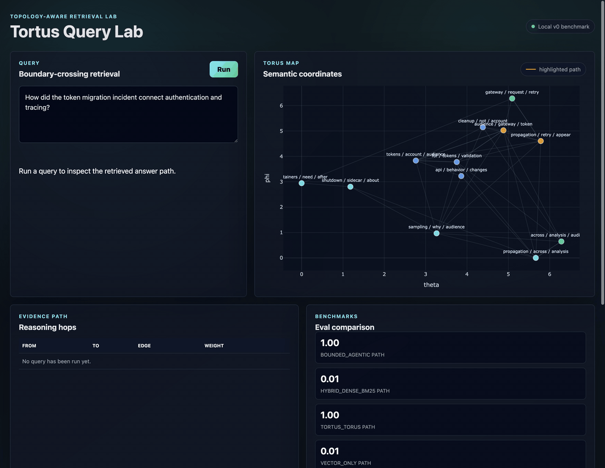
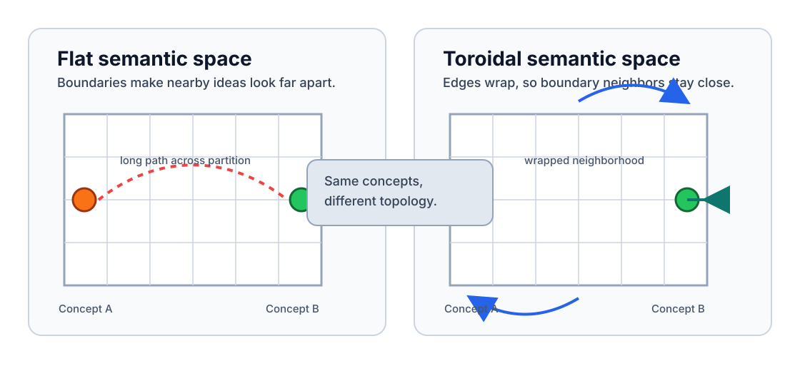
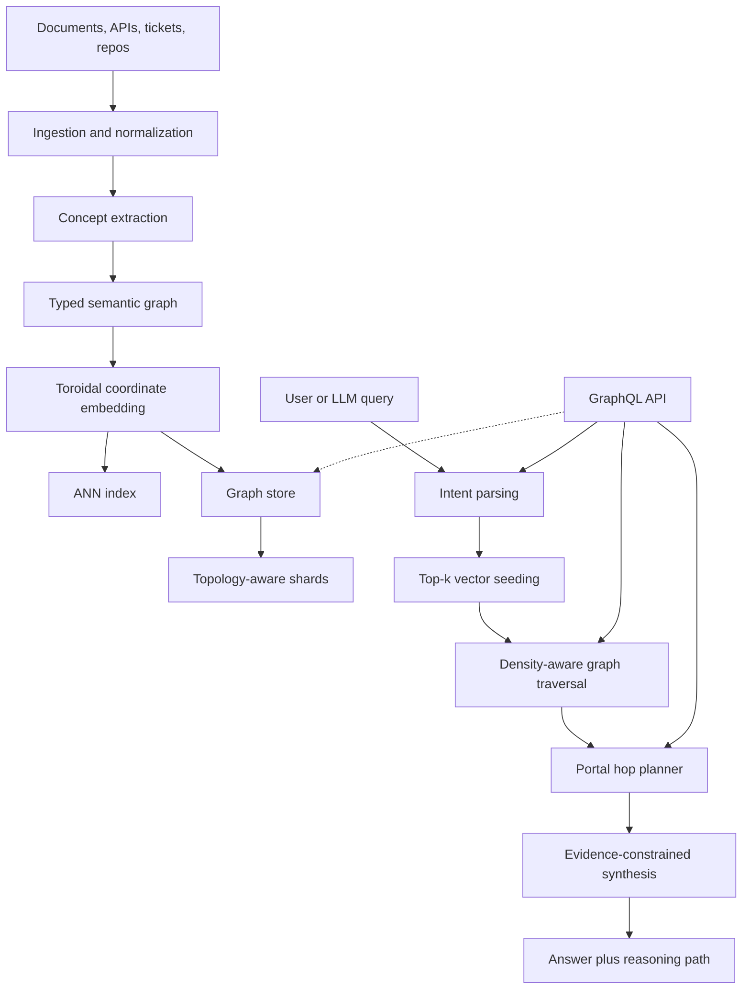

# Tortus: Toroidal Semantic Graph Retrieval



Tortus is a design-stage retrieval architecture for explainable, multi-hop RAG over large and federated knowledge bases.

The core idea is simple: instead of treating knowledge as a flat set of embedded chunks, Tortus models it as a typed semantic graph embedded onto a soft toroidal manifold. Queries start with vector retrieval, then traverse concept edges, cross domain portals when needed, and return both an answer and the path that produced it.

The bet: topology-aware traversal can improve multi-hop retrieval without turning retrieval into an unbounded agent loop.

> Query concepts, not just chunks. Return reasoning paths, not just citations.

## Status

This repository now contains the first executable v0 slice: a Python package, typed graph schemas, deterministic engineering corpus with distractors, local embedding fallback, exact vector, BM25, hybrid, community-summary, and bounded-agentic baselines, SQLite graph store, toroidal projection, bounded traversal, portal-hop limits, shard-fanout simulation, GraphQL/FastAPI endpoint, dashboard query lab, CLI, strategy-comparison smoke/golden/stress/full/benchmark evals, path-recall metrics, layout ablations, JSON/DuckDB eval exports, benchmark-report generation, and a reproducible demo script.

The implementation is still early. The intended MVP remains a local prototype that validates whether toroidal graph locality plus typed traversal improves multi-hop retrieval quality, explainability, and shard affinity compared with vector-only RAG, hybrid sparse+dense retrieval, and conventional GraphRAG baselines.

Current evidence strength is prototype-level. The benchmark numbers below are useful for checking whether the architecture and evaluation harness behave coherently, but they are not yet a research claim about real-world retrieval superiority.

| Layer | Current state | Evidence implication | Hardening move |
| --- | --- | --- | --- |
| Corpus | Built-in engineering mini-corpus with synthetic incidents, runbooks, and distractors. | Good for deterministic system tests; too small and self-authored for external validity. | Add commit-pinned public Kubernetes, OpenTelemetry, and architecture/RFC corpora with snapshot manifests. |
| Embeddings | Local hash embedding fallback, with API-backed embedding adapter available. | Validates interfaces and reproducibility; does not prove semantic embedding quality. | Run cached `text-embedding-3-large` or equivalent embeddings and report cost, cache hits, and drift. |
| Extraction | Deterministic term and edge extraction. | Makes tests repeatable; does not test noisy LLM concept extraction. | Add schema-constrained LLM extraction, confidence calibration, retry handling, and human spot checks. |
| Eval labels | 100-question candidate set generated from known source patterns. | Useful pressure test; not a completed golden set. | Manually audit expected evidence URIs, path labels, and negative cases before treating metrics as benchmark results. |
| Baselines | Local vector, BM25, hybrid, graph-local, layout, community-summary, and bounded-agentic approximations. | Good sanity checks; not a final comparison to external systems. | Add serious GraphRAG/RAPTOR/HippoRAG/LightRAG-style implementations or clearly scoped reproductions. |
| Scale | 116 v0 questions over a tiny graph. | Shows mechanics and failure modes; not enough statistical power. | Expand to audited multi-corpus evals with confidence intervals and failure taxonomy by query type. |

## Quickstart

```bash
python3 -m venv .venv
.venv/bin/python -m pip install -e '.[dev]'

.venv/bin/tortus ingest --corpus engineering
.venv/bin/tortus index --layout torus
.venv/bin/tortus query "How did the token migration incident connect authentication and tracing?" --explain
.venv/bin/tortus golden-set --out data/golden_set.json --count 100
.venv/bin/tortus eval --suite benchmark --strategies all \
  --json-out data/eval/benchmark.json \
  --duckdb-out data/eval/results.duckdb
.venv/bin/tortus report \
  --eval-json data/eval/benchmark.json \
  --out data/reports/eval-report.md
.venv/bin/tortus serve --port 8010
# Dashboard running at http://localhost:8010
```

Or run the full local demo path:

```bash
scripts/demo.sh
```

Run checks:

```bash
.venv/bin/ruff check .
.venv/bin/mypy src/tortus scripts/run_pytest.py
.venv/bin/python scripts/run_pytest.py
```

`scripts/run_pytest.py` exists because some macOS Python builds crash when pytest imports `readline` during startup. It only disables that optional import for pytest.

## Problem

Most production RAG systems are strong at retrieving nearby text and weak at preserving relationships between ideas. That creates recurring failures:

| Failure mode | What happens | Why it matters |
| --- | --- | --- |
| Chunk blindness | The retriever finds relevant fragments but misses the conceptual path between them. | Answers become locally plausible and globally incomplete. |
| Boundary artifacts | Clusters, domains, and shards create artificial edges in the knowledge space. | Cross-domain questions degrade exactly where synthesis is needed most. |
| Weak provenance | Citations point to documents, but not to the reasoning path through concepts. | Users cannot audit why the system connected one fact to another. |
| Prompt-hidden retrieval logic | Traversal policies live inside prompts or app code. | Developers cannot inspect, tune, or constrain retrieval behavior cleanly. |
| Cost drift | Agentic search keeps expanding until a budget or timeout stops it. | Latency and LLM spend become difficult to predict. |

Tortus targets knowledge systems where the answer depends on a path across concepts: engineering design history, policy reasoning, incident analysis, compliance research, product knowledge, and technical support.



Tortus is a design-stage retrieval architecture for explainable, multi-hop RAG over large and federated knowledge bases.

The core idea is simple: instead of treating knowledge as a flat set of embedded chunks, Tortus models it as a typed semantic graph embedded onto a soft toroidal manifold. Queries start with vector retrieval, then traverse concept edges, cross domain portals when needed, and return both an answer and the path that produced it.

The bet: topology-aware traversal can improve multi-hop retrieval without turning retrieval into an unbounded agent loop.

> Query concepts, not just chunks. Return reasoning paths, not just citations.

## Status

This repository is currently an architecture/specification draft. There is no implementation yet.

The intended MVP is a local prototype that validates whether toroidal graph locality plus typed traversal improves multi-hop retrieval quality, explainability, and shard affinity compared with vector-only RAG, hybrid sparse+dense retrieval, and conventional GraphRAG baselines.

## Problem

Most production RAG systems are strong at retrieving nearby text and weak at preserving relationships between ideas. That creates recurring failures:

| Failure mode | What happens | Why it matters |
| --- | --- | --- |
| Chunk blindness | The retriever finds relevant fragments but misses the conceptual path between them. | Answers become locally plausible and globally incomplete. |
| Boundary artifacts | Clusters, domains, and shards create artificial edges in the knowledge space. | Cross-domain questions degrade exactly where synthesis is needed most. |
| Weak provenance | Citations point to documents, but not to the reasoning path through concepts. | Users cannot audit why the system connected one fact to another. |
| Prompt-hidden retrieval logic | Traversal policies live inside prompts or app code. | Developers cannot inspect, tune, or constrain retrieval behavior cleanly. |
| Cost drift | Agentic search keeps expanding until a budget or timeout stops it. | Latency and LLM spend become difficult to predict. |

Tortus targets knowledge systems where the answer depends on a path across concepts: engineering design history, policy reasoning, incident analysis, compliance research, product knowledge, and technical support.


Flat partitions create artificial distance; toroidal wrapping preserves neighborhood continuity across boundaries.

## Core Hypothesis

A semantic graph embedded on a toroidal coordinate space can make retrieval more navigable and operationally scalable by combining:

- vector search for fast candidate generation
- typed graph edges for explainable multi-hop traversal
- toroidal locality for wraparound neighborhoods and topology-aware sharding
- GraphQL directives for developer-controlled traversal behavior
- budget-aware LLM synthesis over explicit evidence paths

The torus is not treated as magic. It is a systems hypothesis that should be validated against measurable baselines.

## Non-Goals

Tortus is not trying to be:

- a general replacement for vector databases
- a fully autonomous research agent
- a knowledge graph ontology project
- a prompt-only retrieval strategy
- a claim that toroidal topology is always better than Euclidean or hyperbolic layouts

The goal is narrower: test whether topology-aware semantic graph traversal gives better answers for multi-hop, cross-domain retrieval problems where provenance and cost control matter.

## Why a Torus?

Traditional vector and graph layouts often have boundary effects: points near the edge of a cluster or partition can be artificially far from related concepts. A toroidal space wraps both axes, so neighborhoods do not terminate at hard borders.

In Tortus, toroidal coordinates are used for three concrete jobs:

| Job | Expected benefit | What must be proven |
| --- | --- | --- |
| Neighborhood traversal | Smooth cyclic continuity around dense concept regions. | Better multi-hop recall at equal latency. |
| Sharding | Locality-preserving partitioning without hard semantic edges. | Higher shard affinity and cache hit rate. |
| Federation | Portal hops between overlapping subgraphs without treating every domain boundary as a cliff. | Better cross-domain path quality under budget. |

If the toroidal embedding does not beat simpler layouts in evaluation, it should be replaced. The architecture is designed to make that comparison explicit.

## Competitive Context

Tortus sits between several existing retrieval patterns:

| Pattern | Strength | Limitation Tortus targets |
| --- | --- | --- |
| Vector-only RAG | Fast semantic recall over large corpora. | Weak relationship modeling and shallow provenance. |
| Hybrid sparse+dense retrieval | Strong lexical plus semantic matching. | Still returns ranked items, not concept paths. |
| Knowledge graphs | Explicit relationships and auditability. | Often brittle, expensive to build, and disconnected from embedding-based recall. |
| GraphRAG | Better global summaries and community-level context. | Can blur source-level paths and make query-time control indirect. |
| Agentic search | Flexible multi-step exploration. | Harder to bound, inspect, reproduce, and optimize. |

Tortus attempts to combine the useful parts: fast candidate generation, explicit relationships, bounded traversal, and source-backed answer synthesis.

## Architecture



## Data Model

Tortus separates semantic content from traversal control.

| Entity | Purpose |
| --- | --- |
| `ConceptNode` | A concept, entity, claim, chunk, document section, API, decision, or event. |
| `SemanticEdge` | A typed relationship such as `supports`, `contradicts`, `depends_on`, `caused_by`, `implements`, or `related_to`. |
| `SubgraphMembership` | Weighted membership in one or more domains, teams, products, sources, or tenants. |
| `PortalEdge` | A controlled cross-subgraph jump used when a query needs domain switching. |
| `EvidenceSpan` | A source-backed span attached to a node or edge for traceability. |
| `TraversalPolicy` | Runtime constraints such as hop budget, latency budget, personalization, freshness, or locality. |

Example node shape:

```json
{
  "id": "concept:llm-bias-evaluation",
  "label": "LLM bias evaluation",
  "kind": "concept",
  "embeddingRef": "emb:9f31",
  "torus": { "theta": 1.84, "phi": 5.12 },
  "memberships": [
    { "subgraph": "ai-governance", "weight": 0.82 },
    { "subgraph": "model-evaluation", "weight": 0.64 }
  ],
  "evidence": [
    { "uri": "docs://eval/bias.md", "span": [120, 184] }
  ]
}
```

## Query API

GraphQL is used as a developer-facing control plane for retrieval. It does not replace the graph store; it gives callers a typed way to constrain traversal.

```graphql
query ExplainConcept($id: ID!) {
  concept(id: $id)
    @semanticGroup(name: "Governance")
    @portalPreference(type: "RecentCaseLaw")
    @failoverPlan(level: 1)
    @explainHops
  {
    id
    label
    confidence
    answer
    reasoningPath {
      from
      to
      edgeType
      weight
      evidence {
        uri
        span
      }
    }
  }
}
```

Planned directives:

| Directive | Purpose |
| --- | --- |
| `@semanticGroup(name: String!)` | Prefer a domain-specific subgraph. |
| `@portalPreference(type: String!)` | Bias cross-subgraph portal selection. |
| `@failoverPlan(level: Int!)` | Allow bounded retries or partial answers. |
| `@explainHops` | Return the traversal path and evidence spans. |
| `@noPersonalization` | Disable user-context personalization. |
| `@localOnly` | Prevent portal hops outside the selected subgraph. |
| `@budget(maxHops: Int, maxMs: Int, maxTokens: Int)` | Bound latency, depth, and LLM cost. |

## Retrieval Algorithm

At query time, Tortus follows a bounded retrieval plan:

1. Parse query intent, constraints, and GraphQL directives.
2. Generate seed candidates with ANN vector search.
3. Map candidates to graph nodes and toroidal coordinates.
4. Estimate local density around each seed.
5. Expand through typed edges using a density-aware radius.
6. Score frontier nodes with semantic similarity, edge weight, freshness, evidence quality, and policy constraints.
7. Trigger portal hops when the frontier has low coverage or the query implies domain switching.
8. Select evidence paths under hop, latency, and token budgets.
9. Synthesize an answer only from selected evidence.
10. Return the answer, confidence, path, and degraded-mode warnings when applicable.

Traversal score sketch:

```text
score(next) =
  semantic_similarity(query, next)
  + edge_weight(current, next)
  + evidence_quality(next)
  + freshness_bias(next)
  - traversal_cost(next)
  - uncertainty_penalty(next)
```

The exact scoring function is intentionally replaceable. The MVP should make retrieval policies easy to compare rather than hard-coding one strategy.

## Evaluation Plan

Tortus should be judged by evidence, not novelty language.

| Dimension | Metrics |
| --- | --- |
| Retrieval quality | recall@k, multi-hop path recall, answer faithfulness, contradiction rate |
| Path quality | hop precision, evidence coverage, path minimality, human audit score |
| System performance | p50/p95 latency, shard fanout, cache hit rate, index update cost |
| Cost control | tokens per answered query, LLM calls per query, timeout rate |
| Federation | cross-subgraph success rate, partial-answer quality, failover rate |

Current v0 eval strategies:

- `tortus_torus`
- `vector_only`
- `bm25`
- `hybrid_dense_bm25`
- `graph_local`
- `community_summary`
- `bounded_agentic`
- `torus_layout`
- `euclidean_layout`
- `random_layout`

Current v0 sanity benchmark, using `tortus eval --suite benchmark --strategies all` over 116 questions and 1,160 strategy rows. A pass requires term recall >= 0.50, source recall >= 0.50, and path recall >= 0.50:

| Strategy | Pass | Source recall | Path recall | p95 latency ms | Mean portal hops | Mean shard fanout |
| --- | --- | --- | --- | --- | --- | --- |
| `tortus_torus` | 0.94 | 0.89 | 1.00 | 1.6 | 8.0 | 8.6 |
| `bounded_agentic` | 0.84 | 0.73 | 1.00 | 1.8 | 3.0 | 4.5 |
| `graph_local` | 0.21 | 0.98 | 0.16 | 1.2 | 0.0 | 8.0 |
| `vector_only` | 0.01 | 0.79 | 0.01 | 0.6 | 0.0 | 4.6 |
| `bm25` | 0.01 | 0.73 | 0.01 | 0.4 | 0.0 | 4.4 |
| `hybrid_dense_bm25` | 0.01 | 0.82 | 0.01 | 0.8 | 0.0 | 4.5 |
| `community_summary` | 0.01 | 0.61 | 0.01 | 0.4 | 0.0 | 3.9 |
| `torus_layout` | 0.01 | 0.64 | 0.01 | 0.6 | 0.0 | 4.2 |
| `euclidean_layout` | 0.01 | 0.62 | 0.01 | 0.4 | 0.0 | 4.7 |
| `random_layout` | 0.01 | 0.46 | 0.01 | 0.4 | 0.0 | 4.6 |

The positive signal is path recall on boundary-crossing, stress, and candidate-golden questions. The negative signal is high fanout: Tortus wins recall by spending more portal and shard budget than the bounded-agentic baseline. Because the corpus, extraction, embeddings, and labels are still controlled fixtures, this table should be read as a v0 harness result, not as proof that toroidal retrieval beats production baselines. The current research target is to reduce fanout without losing path quality, then rerun on an audited external corpus.

The `data/golden_set.json` file is a deterministic 100-question candidate golden set with expected evidence URIs and hop targets. Its `audit_status` is intentionally `candidate_needs_human_review`; it is ready for manual review, not falsely presented as a completed human-audited benchmark.

Remaining work for a publishable v1:

- replace deterministic approximations with external GraphRAG and agentic-search implementations
- scale beyond the built-in corpus to commit-pinned public engineering docs
- manually audit and revise the 100-question candidate golden set
- profile real API-backed embedding and synthesis cost

```text
score(next) =
  semantic_similarity(query, next)
  + edge_weight(current, next)
  + evidence_quality(next)
  + freshness_bias(next)
  - traversal_cost(next)
  - uncertainty_penalty(next)
```

The exact scoring function is intentionally replaceable. The MVP should make retrieval policies easy to compare rather than hard-coding one strategy.

## Evaluation Plan

Tortus should be judged by evidence, not novelty language.

| Dimension | Metrics |
| --- | --- |
| Retrieval quality | recall@k, multi-hop path recall, answer faithfulness, contradiction rate |
| Path quality | hop precision, evidence coverage, path minimality, human audit score |
| System performance | p50/p95 latency, shard fanout, cache hit rate, index update cost |
| Cost control | tokens per answered query, LLM calls per query, timeout rate |
| Federation | cross-subgraph success rate, partial-answer quality, failover rate |

Required baselines:

- vector-only RAG
- BM25 plus dense hybrid retrieval
- conventional knowledge graph lookup
- GraphRAG-style community summaries
- agentic search with tool calls

The project is successful only if it can show a measurable improvement for questions that require concept paths, while staying competitive on latency and cost.

## MVP Scope

The first implementation should be small enough to finish and rigorous enough to learn from.

| Phase | Deliverable |
| --- | --- |
| 0 | Finalize schema, traversal interfaces, and evaluation dataset. |
| 1 | Build a local graph index over a small technical-document corpus. |
| 2 | Add toroidal coordinates, ANN seeding, and typed edge traversal. |
| 3 | Expose GraphQL query directives and reasoning-path responses. |
| 4 | Run baseline comparisons and publish results. |
| 5 | Add portal hops and topology-aware sharding if earlier phases justify them. |

Current repository shape:

```text
src/
  tortus/
    corpus.py       built-in engineering corpus and chunking
    extract.py      deterministic concept and edge extraction
    embeddings.py   local and Azure OpenAI embedding adapters
    graph_store.py  SQLite graph persistence
    torus.py        toroidal distance and projection
    traversal.py    bounded path retrieval
    baselines.py    vector, BM25, hybrid, community, agentic, local-graph, and Tortus runners
    sharding.py     toroidal shard assignment and crossing metrics
    golden.py       deterministic candidate golden-set generation
    api.py          FastAPI, GraphQL, and dashboard routes
    eval.py         smoke/golden/stress/full/benchmark evaluation harness
    eval_store.py   JSON and DuckDB eval persistence
    report.py       benchmark markdown report and failure taxonomy
    cli.py          ingest/index/query/golden-set/eval/report/serve commands
    templates/      Jinja dashboard shell
    static/         Plotly dashboard JavaScript and CSS
data/
  golden_set.json   100-question candidate golden set requiring manual audit
  reports/
    eval-report.md  generated benchmark report
docs/
  evidence-hardening.md  gates from v0 harness to credible external benchmark
scripts/
  demo.sh           rebuild, query, evaluate, and report
  run_pytest.py     pytest startup wrapper for local macOS stability
tests/
  test_*.py
```

## Design Principles

- Make retrieval inspectable before making it clever.
- Treat LLMs as synthesis and policy helpers, not as hidden databases.
- Return evidence paths for claims that cross concepts.
- Put budgets in the API, not only in deployment config.
- Prefer replaceable retrieval policies over one monolithic agent loop.
- Measure against boring baselines before adding exotic machinery.

## Potential Use Cases

| Domain | Example |
| --- | --- |
| Engineering knowledge | Trace why an API, architecture decision, or reliability pattern changed over time. |
| Support policy reasoning | Connect customer symptoms, policy rules, exceptions, and historical resolutions. |
| Compliance and governance | Traverse regulation, internal controls, audits, and model behavior evidence. |
| Research synthesis | Connect papers, claims, datasets, contradictions, and follow-up questions. |
| Private knowledge assistants | Run local or tenant-scoped concept traversal with explicit privacy controls. |

## Risks and Open Questions

| Risk | Why it matters | Mitigation |
| --- | --- | --- |
| Toroidal layout may not outperform simpler embeddings. | The central topology claim needs proof. | Keep layout pluggable and run direct ablations. |
| Concept extraction can create noisy nodes and edges. | Bad graph structure harms traversal quality. | Track edge provenance and confidence; support pruning. |
| LLM-guided traversal may overfit to plausible paths. | Explanations can become narrative instead of evidence. | Require evidence spans for returned hops. |
| GraphQL directives can become too complex. | Developer ergonomics matter for adoption. | Start with a minimal directive set and add only measured needs. |
| Federation can increase latency. | Cross-domain search is expensive. | Enforce hop, shard, time, and token budgets at query time. |

## Research Extensions

- learned edge traversal policies
- contrastive refinement of graph and toroidal embeddings
- path-aware reranking
- visual graph debugger for retrieval traces
- self-healing schema federation
- privacy-preserving local subgraphs

## What I Learned

- Path recall is the real differentiator: vector, BM25, and hybrid retrieval can find terms and nearby sources, but they do not naturally return auditable multi-hop evidence paths.
- The toroidal traversal currently wins by spending more portal and shard budget. The next algorithmic target is reducing fanout while preserving boundary-crossing recall.
- The bounded-agentic baseline is strong enough to keep in the benchmark. Tortus has to justify itself with provenance, reproducibility, and predictable budgets, not only raw recall.
- Candidate golden sets are easy to generate and useful for pressure testing, but the numbers should not be treated as research claims until the evidence labels are manually audited.

## Author

Created by Darsh Garg.

- GitHub: `darshgarg7`
- Email: `darsh.garg@gmail.com`


| Phase | Deliverable |
| --- | --- |
| 0 | Finalize schema, traversal interfaces, and evaluation dataset. |
| 1 | Build a local graph index over a small technical-document corpus. |
| 2 | Add toroidal coordinates, ANN seeding, and typed edge traversal. |
| 3 | Expose GraphQL query directives and reasoning-path responses. |
| 4 | Run baseline comparisons and publish results. |
| 5 | Add portal hops and topology-aware sharding if earlier phases justify them. |

Planned repository shape:

```text
src/
  ingest/        document parsing, chunking, concept extraction
  graph/         nodes, edges, evidence spans, memberships
  embedding/     vector and toroidal coordinate generation
  traversal/     policies, scoring, portal hops
  api/           GraphQL schema and resolvers
  eval/          datasets, baselines, metrics
docs/
  architecture.md
  evaluation.md
```

## Design Principles

- Make retrieval inspectable before making it clever.
- Treat LLMs as synthesis and policy helpers, not as hidden databases.
- Return evidence paths for claims that cross concepts.
- Put budgets in the API, not only in deployment config.
- Prefer replaceable retrieval policies over one monolithic agent loop.
- Measure against boring baselines before adding exotic machinery.

## Potential Use Cases

| Domain | Example |
| --- | --- |
| Engineering knowledge | Trace why an API, architecture decision, or reliability pattern changed over time. |
| Support policy reasoning | Connect customer symptoms, policy rules, exceptions, and historical resolutions. |
| Compliance and governance | Traverse regulation, internal controls, audits, and model behavior evidence. |
| Research synthesis | Connect papers, claims, datasets, contradictions, and follow-up questions. |
| Private knowledge assistants | Run local or tenant-scoped concept traversal with explicit privacy controls. |

## Risks and Open Questions

| Risk | Why it matters | Mitigation |
| --- | --- | --- |
| Toroidal layout may not outperform simpler embeddings. | The central topology claim needs proof. | Keep layout pluggable and run direct ablations. |
| Concept extraction can create noisy nodes and edges. | Bad graph structure harms traversal quality. | Track edge provenance and confidence; support pruning. |
| LLM-guided traversal may overfit to plausible paths. | Explanations can become narrative instead of evidence. | Require evidence spans for returned hops. |
| GraphQL directives can become too complex. | Developer ergonomics matter for adoption. | Start with a minimal directive set and add only measured needs. |
| Federation can increase latency. | Cross-domain search is expensive. | Enforce hop, shard, time, and token budgets at query time. |

## Research Extensions

- learned edge traversal policies
- contrastive refinement of graph and toroidal embeddings
- path-aware reranking
- visual graph debugger for retrieval traces
- self-healing schema federation
- privacy-preserving local subgraphs

## Author

Created by Darsh Garg.

- GitHub: `darshgarg7`
- Email: `darsh.garg@gmail.com`
## License

MIT. Use freely for educational, research, and portfolio purposes.
