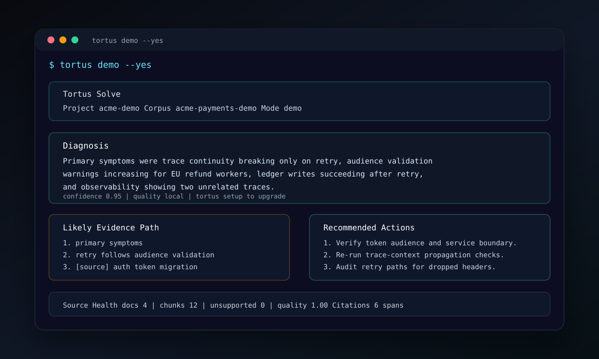
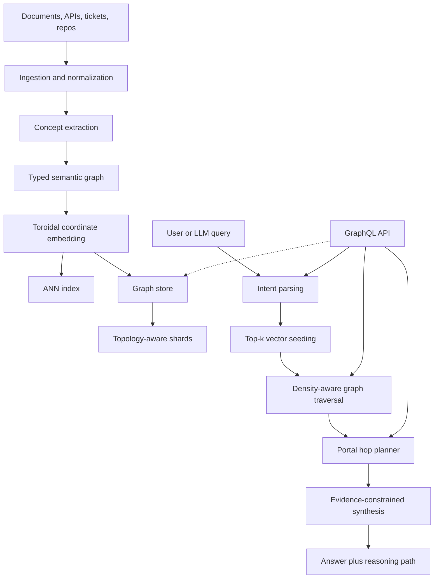

# Tortus: Toroidal Semantic Graph Retrieval




Tortus is a local-first retrieval system for explainable, multi-hop RAG over large and federated knowledge bases.

The core idea is simple: instead of treating knowledge as a flat set of embedded chunks, Tortus models it as a typed semantic graph embedded onto a soft toroidal manifold. Queries start with vector retrieval, then traverse concept edges, cross domain portals when needed, and return both an answer and the path that produced it.

The bet: topology-aware traversal can improve multi-hop retrieval without turning retrieval into an unbounded agent loop.

> Query concepts, not just chunks. Return reasoning paths, not just citations.

## Painful Problem

The hard part of internal knowledge work is often not finding a relevant document. It is figuring out how several relevant documents connect.

In an incident review, for example, the evidence might be split across an auth migration note, a gateway retry runbook, an observability guide, and the incident timeline. Search can find each fragment. A normal RAG answer can summarize the retrieved text. The painful part is still left to the user:

> Which evidence explains what actually happened, and what path connects the facts?

Tortus is built for that gap. It tries to answer "why did this happen?" or "what should we fix?" by returning the evidence path across documents, not only a list of matching chunks.

## Status

This repository now contains an executable V2 slice: a Python distribution named `tortus-rag`, an importable `tortus` package, a `tortus` console command, project-local document ingestion, pinned source snapshots, typed graph schemas, SQLite persistence, local embedding fallback, exact vector search, optional FAISS indexing, source-backed answer synthesis, typed retrieval traces, GraphQL plus `/api/query`, a diagnostic dashboard, local and optional external baseline adapters, audit workflows, package/release checks, CI, and reproducible benchmark reports.

The implementation is still early. The intended MVP remains a local prototype that tests whether toroidal graph locality plus typed traversal improves multi-hop retrieval quality, explainability, and shard affinity compared with vector-only RAG, hybrid sparse+dense retrieval, and local approximations of GraphRAG-style and agentic retrieval. The current baselines are useful engineering controls, not claims that Tortus has beaten every external GraphRAG implementation.

Current evidence strength is prototype-level. The benchmark numbers below are useful for checking whether the architecture and evaluation harness behave coherently, but they are not yet a research claim about real-world retrieval superiority.

| Layer | Current state | Evidence implication | Hardening move |
| --- | --- | --- | --- |
| Corpus | Built-in engineering corpus, packaged Acme Payments demo corpus, plus fetchable public Kubernetes, OpenTelemetry, W3C, RFC, SRE, and architecture snapshots. | Better than synthetic-only fixtures; still needs larger audited snapshots before broad claims. | Keep snapshot hashes, dates, licenses, and warnings in reports. |
| Embeddings | Local hash fallback plus OpenAI and Azure OpenAI embedding adapters with provider-scoped caches. | API embeddings can now be tested without cache contamination from local vectors. | Report model, dimensions, cache hits, cost, and drift per run. |
| Extraction | Deterministic term and edge extraction. | Makes tests repeatable; does not test noisy LLM concept extraction. | Add schema-constrained LLM extraction, confidence calibration, retry handling, and human spot checks. |
| Eval labels | Curated labels plus JSONL audit import that can override expected evidence URIs and path labels. Current committed audit rows are assistant-reviewed. | Reports can separate assistant-reviewed, human-reviewed, and pending rows instead of blending them. | Complete maintainer review before treating golden metrics as human-audited. |
| Baselines | Local vector, BM25, hybrid, hybrid graph rerank, graph-local, layout, community-summary, bounded-agentic, real LlamaIndex Core retriever, and optional external command adapters. | Stronger controls; GraphRAG and LightRAG still need configured workspaces to become real comparisons. | Run GraphRAG and LightRAG adapters on the same snapshots. |
| Scale | 118 V2 benchmark questions over a 25-node local graph. | Shows mechanics and failure modes; not enough statistical power. | Expand to audited multi-corpus evals with confidence intervals and failure taxonomy by query type. |

## Installation

Tortus installs as the `tortus-rag` distribution and exposes the `tortus` command.

Requires Python 3.12+. Check your interpreter first:

```bash
python --version
```

```bash
pip install tortus-rag
```

The base install includes Markdown, text, HTML, PDF, folder, and URL ingestion.

For benchmark baselines, install the baseline extra:

```bash
pip install "tortus-rag[baselines]"
```

The dashboard/API server is optional:

```bash
pip install "tortus-rag[api]"
```

From a cloned repo, use the project virtualenv command form shown below:

```bash
.venv/bin/tortus --help
```

After installation, run:

```bash
tortus doctor
```

`doctor` checks the installed package, dashboard assets, optional dependencies, and active data path.

## Quickstart

### One-Command Solve Flow

Install Tortus, point it at your own docs, and ask the question you actually need answered:

```bash
pip install tortus-rag
tortus solve "Why did this incident happen, and what should we fix?" ./docs https://example.com/runbook
```

`tortus solve` creates a hidden local project under `~/.tortus/projects/`, snapshots the supplied files/folders/URLs, builds the graph and vector index, traverses the evidence path, and returns:

- a cited diagnosis
- the likely root-cause/evidence path
- recommended next actions
- missing-evidence warnings
- source-health checks for unsupported, empty, duplicate, or weak documents

If you have an OpenAI or Azure OpenAI key, configure it once:

```bash
tortus setup --provider openai
```

Keys are stored in `~/.tortus/config.toml`, outside the repo. Without a key, Tortus still runs with deterministic local extraction and synthesis, but it labels the result as lower-quality local mode.

Try the packaged demo from any directory:

```bash
tortus demo
```

Write a ticket-ready Markdown report:

```bash
tortus solve "Why did this incident happen, and what should we fix?" ./docs --output report.md
```

Open the most recent solve in the dashboard:

```bash
pip install "tortus-rag[api]"
tortus open --last
```

### Fast Demo From Any Directory

Use the packaged Acme Payments demo corpus if you want to see Tortus work immediately after installation. This does not require cloning the repository or downloading example files:

```bash
tortus ingest --corpus acme-payments-demo --data-dir .tortus/acme-demo
tortus index --corpus acme-payments-demo --data-dir .tortus/acme-demo
tortus query "What should Acme fix to stop EU refund trace fragmentation?" \
  --corpus acme-payments-demo \
  --data-dir .tortus/acme-demo \
  --explain
```

You should see a terminal answer panel, confidence score, retrieval snapshot, evidence spans, and a reasoning-path table.

Open the same demo in the dashboard:

```bash
TORTUS_DATA_DIR=.tortus/acme-demo TORTUS_CORPUS=acme-payments-demo tortus serve --port 8010
```

Then visit `http://127.0.0.1:8010`.

The demo question requires Tortus to connect an incident note, a token migration design note, a gateway retry runbook, and an observability note. A simple retriever can find relevant chunks; Tortus is meant to expose the path between them.

### Run On Your Own Docs

Tortus is designed to run locally against your own documentation.

```bash
tortus init
tortus ingest ./docs README.md
tortus index
tortus query "Which docs explain the rollout risk?" --explain
```

What each step does:

| Step | Command | Result |
| --- | --- | --- |
| Create a workspace | `tortus init` | Writes `tortus.toml` and creates `.tortus/`. |
| Snapshot sources | `tortus ingest ./docs README.md` | Stores normalized documents and chunks. |
| Build retrieval graph | `tortus index` | Builds nodes, edges, embeddings, and vector index. |
| Ask a question | `tortus query "..." --explain` | Returns answer, evidence, confidence, and hops. |

Supported local file types are `.md`, `.mdx`, `.txt`, `.html`, `.htm`, and `.pdf`. URLs work from the base install:

```bash
tortus ingest ./docs https://example.com/post --refresh
```

### Open The Dashboard

After `ingest` and `index`, start the diagnostic workbench:

```bash
pip install "tortus-rag[api]"
tortus serve --port 8010
```

Then open `http://127.0.0.1:8010`. The dashboard shows the answer, evidence spans, selected hops, pruned candidates, portal usage, confidence, and unsupported claims.

### Run From This Repo

If you are working from the cloned repository instead of an installed package, prefix commands with `.venv/bin/`:

```bash
.venv/bin/tortus doctor
.venv/bin/tortus ingest --corpus public-engineering --data-dir data
.venv/bin/tortus index --corpus public-engineering --data-dir data
.venv/bin/tortus query "How do service accounts connect to tracing?" \
  --corpus public-engineering \
  --data-dir data \
  --explain
```

Use `--data-dir data` for repo benchmark commands because a local `tortus.toml` may point normal workspace commands at `.tortus/data`.
### Python API Usage

You can also use Tortus directly in your Python code as a library:

```python
import tortus
from tortus.config import Settings
from tortus.pipeline import build_index, load_engine

settings = Settings(TORTUS_CORPUS="public-engineering")
build_index(settings)
engine = load_engine(settings)

# Query the graph
result = engine.answer("How do service accounts connect to tracing?")

# Print the synthesized answer
print(result.answer)

# Audit the multi-hop reasoning path
for hop in result.reasoning_path:
    print(f"{hop.from_node} --[{hop.edge_type}]--> {hop.to_node}")
```

### Run The Benchmark

The benchmark is for development evidence, not the normal user path:

```bash
.venv/bin/tortus ingest --corpus public-engineering --data-dir data
.venv/bin/tortus index --layout torus --corpus public-engineering --data-dir data
.venv/bin/tortus golden-set --out data/golden_set.json --count 100
.venv/bin/tortus eval --suite benchmark --strategies all_with_external \
  --corpus public-engineering \
  --data-dir data \
  --audit-file data/audits/golden100.codex-reviewed.jsonl \
  --json-out data/eval/benchmark.json \
  --duckdb-out data/eval/results.duckdb
.venv/bin/tortus report \
  --eval-json data/eval/benchmark.json \
  --out data/reports/eval-report.md
.venv/bin/tortus serve --port 8010
```

The eval command prints a compact strategy summary by default. Add `--rows` if you want every per-question row:

```bash
.venv/bin/tortus eval --suite smoke --strategies tortus_torus,vector_only_local --rows
```

### Developer Checks

Use these before opening a PR or publishing a package:

```bash
.venv/bin/ruff check .
.venv/bin/mypy src/tortus scripts/run_pytest.py
.venv/bin/python scripts/run_pytest.py
.venv/bin/python -m build
.venv/bin/twine check dist/*
.venv/bin/tortus release-check
```

Useful configuration:

```bash
TORTUS_CORPUS=public-engineering
TORTUS_EMBEDDING_PROVIDER=local
TORTUS_EMBEDDING_MODEL=text-embedding-3-large
TORTUS_VECTOR_BACKEND=exact
TORTUS_GRAPHRAG_COMMAND=""
TORTUS_LLAMA_INDEX_COMMAND=""
TORTUS_LIGHTRAG_COMMAND=""
```

`TORTUS_VECTOR_BACKEND=faiss` enables the optional FAISS index path when `faiss` is installed. Exact search remains the default because it is deterministic and easy to test.

`llamaindex_external` uses LlamaIndex Core directly when `llama-index-core` is installed. `TORTUS_GRAPHRAG_COMMAND` and `TORTUS_LIGHTRAG_COMMAND` enable the GraphRAG and LightRAG command adapters. If a dependency or command is missing, benchmark reports mark that adapter as skipped rather than counting it as a win.

To use API embeddings:

```bash
OPENAI_API_KEY=sk-...
tortus index --embedding-provider openai --embedding-model text-embedding-3-large
tortus query "How do service accounts connect to tracing?" --embedding-provider openai
```

Azure OpenAI embeddings use `TORTUS_EMBEDDING_PROVIDER=azure` plus `AZURE_OPENAI_ENDPOINT`, `AZURE_OPENAI_API_KEY`, and `AZURE_OPENAI_EMBEDDING_DEPLOYMENT`.

To materialize external public snapshots:

```bash
tortus corpus fetch --fetch --materialize --corpus external-engineering
tortus index --corpus external-engineering
```

The fetch writes raw responses, normalized text, headers, SHA256 hashes, retrieval timestamps, license notes, and extraction warnings under the configured cache and data directories.

## User Document Ingestion Details

The Quickstart above shows the normal workspace flow. A few useful ingestion variants:

```bash
tortus ingest ./docs
tortus ingest README.md ./docs https://example.com
tortus ingest --manifest sources.toml
```

Supported local file types are `.md`, `.mdx`, `.txt`, `.html`, `.htm`, and `.pdf`. URL ingestion stores a pinned raw snapshot, normalized text, metadata, SHA256, retrieval timestamp, content type, ETag, Last-Modified, and extraction warnings. HTML extraction uses `trafilatura` with BeautifulSoup fallback; PDF extraction uses `pypdf` and keeps empty/scanned PDFs as warned documents instead of pretending they worked.

Configuration precedence is CLI flags, environment variables, `tortus.toml`, then defaults. After `tortus init`, workspace runtime files live under `.tortus/`.

`scripts/run_pytest.py` exists because some macOS Python builds crash when pytest imports `readline` during startup. It only disables that optional import for pytest.

## Problem

Most production RAG systems are strong at retrieving nearby text and weak at preserving relationships between ideas. That creates recurring failures:

| Failure mode | What happens | Why it matters |
| --- | --- | --- |
| Chunk blindness | The retriever finds relevant fragments but misses the conceptual path between them. | Answers become locally plausible and globally incomplete. |
| Boundary artifacts | Clusters, domains, and shards create artificial edges in the knowledge space. | Cross-domain questions degrade exactly where synthesis is needed most. |
| Weak provenance | Citations point to documents, but not to the reasoning path through concepts. | Users cannot audit why the system connected one fact to another. |
| Prompt-hidden retrieval logic | Traversal policies live inside prompts or app code. | Developers cannot inspect, tune, or constrain retrieval behavior cleanly. |
| Cost drift | Agentic search keeps expanding until a budget or timeout stops it. | Latency and LLM spend become difficult to predict. |

Tortus targets knowledge systems where the answer depends on a path across concepts: engineering design history, policy reasoning, incident analysis, compliance research, product knowledge, and technical support.


Flat partitions create artificial distance; toroidal wrapping preserves neighborhood continuity across boundaries.

## Core Hypothesis

A semantic graph embedded on a toroidal coordinate space can make retrieval more navigable and operationally scalable by combining:

- vector search for fast candidate generation
- typed graph edges for explainable multi-hop traversal
- toroidal locality for wraparound neighborhoods and topology-aware sharding
- GraphQL directives for developer-controlled traversal behavior
- budget-aware LLM synthesis over explicit evidence paths

The torus is not treated as magic. It is a systems hypothesis that should be validated against measurable baselines.

## Non-Goals

Tortus is not trying to be:

- a general replacement for vector databases
- a fully autonomous research agent
- a knowledge graph ontology project
- a prompt-only retrieval strategy
- a claim that toroidal topology is always better than Euclidean or hyperbolic layouts

The goal is narrower: test whether topology-aware semantic graph traversal gives better answers for multi-hop, cross-domain retrieval problems where provenance and cost control matter.

## Why a Torus?

Traditional vector and graph layouts often have boundary effects: points near the edge of a cluster or partition can be artificially far from related concepts. A toroidal space wraps both axes, so neighborhoods do not terminate at hard borders.

In Tortus, toroidal coordinates are used for three concrete jobs:

| Job | Expected benefit | What must be proven |
| --- | --- | --- |
| Neighborhood traversal | Smooth cyclic continuity around dense concept regions. | Better multi-hop recall at equal latency. |
| Sharding | Locality-preserving partitioning without hard semantic edges. | Higher shard affinity and cache hit rate. |
| Federation | Portal hops between overlapping subgraphs without treating every domain boundary as a cliff. | Better cross-domain path quality under budget. |

If the toroidal embedding does not beat simpler layouts in evaluation, it should be replaced. The architecture is designed to make that comparison explicit.

## Competitive Context

Tortus sits between several existing retrieval patterns:

| Pattern | Strength | Limitation Tortus targets |
| --- | --- | --- |
| Vector-only RAG | Fast semantic recall over large corpora. | Weak relationship modeling and shallow provenance. |
| Hybrid sparse+dense retrieval | Strong lexical plus semantic matching. | Still returns ranked items, not concept paths. |
| Knowledge graphs | Explicit relationships and auditability. | Often brittle, expensive to build, and disconnected from embedding-based recall. |
| GraphRAG | Better global summaries and community-level context. | Can blur source-level paths and make query-time control indirect. |
| Agentic search | Flexible multi-step exploration. | Harder to bound, inspect, reproduce, and optimize. |

Tortus attempts to combine the useful parts: fast candidate generation, explicit relationships, bounded traversal, and source-backed answer synthesis.

## What Tortus Beats And Does Not Beat Yet

Current Tortus is strongest when the question needs an auditable path across concepts and domains. It can return source spans, hop types, matched terms, toroidal locality scores, and portal reasons instead of only a ranked list of chunks.

Tortus does **not** yet prove broad superiority over production GraphRAG or agentic retrieval systems. The current GraphRAG-style and bounded-agentic baselines are local approximations that exist to pressure-test the retrieval policy. A publishable claim needs external baseline implementations, larger public corpora, real semantic embeddings, and human-reviewed labels.

| Scenario | Current read |
| --- | --- |
| Single-hop factual retrieval | Vector, BM25, and Tortus can all perform well; Tortus may be extra overhead. |
| Multi-hop incident analysis | Tortus is useful because it exposes the evidence path and portal hops. |
| Boundary-crossing questions | Tortus can help when traversal needs to cross domains under explicit budgets. |
| Unanswerable questions | Tortus now withholds answers when selected evidence has no lexical support. |
| Large-scale production search | Not proven yet; optional FAISS support is the first step, not the endpoint. |

## Failure Examples

The useful failure modes are intentionally visible:

- A query about weather or stock recommendations should return “not enough source-backed evidence” instead of forcing a knowledge path.
- A broad incident query can still over-expand through portals if shared terms are too generic.
- A local-only graph policy can find relevant sources but miss expected boundary-crossing path labels.
- Layout-only probes can retrieve nearby nodes without proving a reasoning path.
- Candidate golden labels remain `curated_pending_human_signoff` until a human maintainer reviews evidence spans.

## Diagnostic Workbench

The installed dashboard is meant to debug retrieval, not just display a pretty graph. A query returns typed diagnostics through GraphQL and the lightweight `/api/query` endpoint:

- seed hits with dense and lexical score components
- selected hops with matched terms, toroidal distance, and reasons
- pruned candidates with prune reasons
- portal decisions and portal budget use
- selected evidence spans
- answer claims and unsupported or weakly supported claims

This is deliberately exposed as product surface because traversal quality is impossible to improve if the rejected candidates and score components disappear inside logs.

## Architecture



## Data Model

Tortus separates semantic content from traversal control.

| Entity | Purpose |
| --- | --- |
| `ConceptNode` | A concept, entity, claim, chunk, document section, API, decision, or event. |
| `SemanticEdge` | A typed relationship such as `supports`, `contradicts`, `depends_on`, `caused_by`, `implements`, or `related_to`. |
| `SubgraphMembership` | Weighted membership in one or more domains, teams, products, sources, or tenants. |
| `PortalEdge` | A controlled cross-subgraph jump used when a query needs domain switching. |
| `EvidenceSpan` | A source-backed span attached to a node or edge for traceability. |
| `TraversalPolicy` | Runtime constraints such as hop budget, latency budget, personalization, freshness, or locality. |

Example node shape:

```json
{
  "id": "concept:llm-bias-evaluation",
  "label": "LLM bias evaluation",
  "kind": "concept",
  "embeddingRef": "emb:9f31",
  "torus": { "theta": 1.84, "phi": 5.12 },
  "memberships": [
    { "subgraph": "ai-governance", "weight": 0.82 },
    { "subgraph": "model-evaluation", "weight": 0.64 }
  ],
  "evidence": [
    { "uri": "docs://eval/bias.md", "span": [120, 184] }
  ]
}
```

## Query API

GraphQL is used as a developer-facing control plane for retrieval. It does not replace the graph store; it gives callers a typed way to constrain traversal.

```graphql
query ExplainConcept($id: ID!) {
  concept(id: $id)
    @semanticGroup(name: "Governance")
    @portalPreference(type: "RecentCaseLaw")
    @failoverPlan(level: 1)
    @explainHops
  {
    id
    label
    confidence
    answer
    reasoningPath {
      from
      to
      edgeType
      weight
      evidence {
        uri
        span
      }
    }
  }
}
```

Planned directives:

| Directive | Purpose |
| --- | --- |
| `@semanticGroup(name: String!)` | Prefer a domain-specific subgraph. |
| `@portalPreference(type: String!)` | Bias cross-subgraph portal selection. |
| `@failoverPlan(level: Int!)` | Allow bounded retries or partial answers. |
| `@explainHops` | Return the traversal path and evidence spans. |
| `@noPersonalization` | Disable user-context personalization. |
| `@localOnly` | Prevent portal hops outside the selected subgraph. |
| `@budget(maxHops: Int, maxMs: Int, maxTokens: Int)` | Bound latency, depth, and LLM cost. |

## Retrieval Algorithm

At query time, Tortus follows a bounded retrieval plan:

1. Parse query intent, constraints, and GraphQL directives.
2. Generate seed candidates with ANN vector search.
3. Map candidates to graph nodes and toroidal coordinates.
4. Estimate local density around each seed.
5. Expand through typed edges using a density-aware radius.
6. Score frontier nodes with semantic similarity, edge weight, freshness, evidence quality, and policy constraints.
7. Trigger portal hops when the frontier has low coverage or the query implies domain switching.
8. Select evidence paths under hop, latency, and token budgets.
9. Synthesize an answer only from selected evidence.
10. Return the answer, confidence, path, and degraded-mode warnings when applicable.

Traversal score sketch:

```text
score(next) =
  semantic_similarity(query, next)
  + edge_weight(current, next)
  + evidence_quality(next)
  + freshness_bias(next)
  - traversal_cost(next)
  - uncertainty_penalty(next)
```

The exact scoring function is intentionally replaceable. The MVP should make retrieval policies easy to compare rather than hard-coding one strategy.

## Evaluation Plan

Tortus should be judged by evidence, not novelty language.

| Dimension | Metrics |
| --- | --- |
| Retrieval quality | recall@k, multi-hop path recall, answer faithfulness, contradiction rate |
| Path quality | hop precision, evidence coverage, path minimality, human audit score |
| System performance | p50/p95 latency, shard fanout, cache hit rate, index update cost |
| Cost control | tokens per answered query, LLM calls per query, timeout rate |
| Federation | cross-subgraph success rate, partial-answer quality, failover rate |

Current V2 eval strategies:

- `tortus_torus`
- `vector_only_local`
- `bm25_local`
- `hybrid_dense_bm25_local`
- `hybrid_graph_rerank_local`
- `graph_local`
- `community_summary_local`
- `bounded_agentic_local`
- `torus_layout_local`
- `euclidean_layout_local`
- `random_layout_local`
- `graphrag_external` when optional dependency and command configuration are present
- `llamaindex_external` when LlamaIndex Core is installed, or when `TORTUS_LLAMA_INDEX_COMMAND` is configured as a fallback
- `lightrag_external` when `TORTUS_LIGHTRAG_COMMAND` is configured

The older unqualified strategy names remain accepted as CLI aliases and map to the `_local` strategies.

Current V2 benchmark, using `tortus eval --suite benchmark --strategies all_with_external --corpus public-engineering --data-dir data --audit-file data/audits/golden100.codex-reviewed.jsonl` over 118 questions and 1,652 strategy rows. LlamaIndex Core runs as a real external retriever baseline; GraphRAG and LightRAG are skipped unless their command configuration is present. A pass requires term recall >= 0.50, source recall >= 0.50, path recall >= 0.50, and faithfulness >= 0.50 for answerable questions. Negative questions pass only when unsupported answers are withheld:

| Strategy | Pass | Source | Path | Precision | Faith | p95 ms | Portals | Fanout |
| --- | --- | --- | --- | --- | --- | --- | --- | --- |
| `tortus_torus` | 0.80 | 0.73 | 1.00 | 0.64 | 0.88 | 3.4 | 3.5 | 5.2 |
| `hybrid_graph_rerank_local` | 0.80 | 0.74 | 1.00 | 0.82 | 0.88 | 5.7 | 27.9 | 8.8 |
| `bounded_agentic_local` | 0.73 | 0.67 | 0.95 | 0.86 | 0.89 | 3.0 | 3.0 | 4.4 |
| `graph_local` | 0.14 | 0.58 | 0.17 | 0.34 | 0.88 | 2.2 | 0.0 | 4.3 |
| `llamaindex_external` | 0.01 | 0.72 | 0.03 | 0.03 | 0.88 | 7.5 | 0.0 | 4.3 |
| `hybrid_dense_bm25_local` | 0.01 | 0.73 | 0.03 | 0.03 | 0.88 | 1.5 | 0.0 | 4.4 |
| `vector_only_local` | 0.01 | 0.71 | 0.03 | 0.03 | 0.88 | 0.8 | 0.0 | 4.3 |
| `bm25_local` | 0.02 | 0.65 | 0.03 | 0.03 | 0.88 | 1.0 | 0.0 | 4.2 |
| `community_summary_local` | 0.02 | 0.52 | 0.03 | 0.03 | 0.88 | 1.0 | 0.0 | 4.1 |
| `torus_layout_local` | 0.01 | 0.58 | 0.03 | 0.03 | 0.88 | 1.0 | 0.0 | 3.1 |
| `euclidean_layout_local` | 0.01 | 0.52 | 0.03 | 0.03 | 0.89 | 0.8 | 0.0 | 3.1 |
| `random_layout_local` | 0.01 | 0.32 | 0.03 | 0.03 | 0.89 | 0.8 | 0.0 | 4.3 |

The current signal is useful but still not a broad superiority claim: Tortus and the stronger graph reranker both reach 0.80 pass rate and full path recall on the assistant-reviewed benchmark, while LlamaIndex Core provides a real external vector-retrieval comparison with strong source recall but weak path recall because it does not model hops. Tortus is more selective than `hybrid_graph_rerank_local` on portal hops and fanout, but it still needs better source selection and a real GraphRAG/LightRAG run before external validity claims are fair.

GraphRAG and LightRAG were requested in the latest benchmark run, but their 236 external rows were skipped because no command template was configured. The report records those skipped reasons instead of counting them as wins.

The `data/golden_set.json` file is a deterministic 100-question curated golden set with expected evidence URIs and hop targets. `data/audits/golden100.codex-reviewed.jsonl` is an assistant-reviewed label audit used for current regression runs. It is not human signoff.

Human-audited labels are applied through JSONL, not by mutating generated rows in place:

```bash
tortus audit export --suite golden100 --out data/audits/golden100.audit.jsonl
# review expected_evidence_uris, expected_path_labels, status, auditor, reviewed_at, and notes
tortus audit import data/audits/golden100.audit.jsonl --out data/audits/golden100.reviewed.jsonl
tortus eval --suite benchmark --audit-file data/audits/golden100.reviewed.jsonl
```

Rows only report `human_reviewed` when a review file includes approved/reviewed status, auditor, reviewed timestamp, and a human review type. Codex-reviewed rows are reported separately as `assistant_reviewed`.

Remaining work for a publishable external result:

- run configured external GraphRAG and LightRAG workspaces on the same materialized snapshots
- scale beyond the current public-source manifest to larger commit-pinned public engineering snapshots
- have a human maintainer audit and sign off the 100-question curated golden set
- profile real API-backed embedding and synthesis cost

The project is successful only if it can show a measurable improvement for questions that require concept paths, while staying competitive on latency and cost.

## MVP Scope

The first implementation should be small enough to finish and rigorous enough to learn from.

| Phase | Deliverable |
| --- | --- |
| 0 | Finalize schema, traversal interfaces, and evaluation dataset. |
| 1 | Build a local graph index over a small technical-document corpus. |
| 2 | Add toroidal coordinates, ANN seeding, and typed edge traversal. |
| 3 | Expose GraphQL query directives and reasoning-path responses. |
| 4 | Run baseline comparisons and publish results. |
| 5 | Add portal hops and topology-aware sharding if earlier phases justify them. |

Current repository shape:

```text
src/
  tortus/
    config.py       project config, environment precedence, and settings helpers
    corpus.py       built-in engineering/public corpora and chunking
    corpus_manifest.py pinned public corpus manifest fetch/verify workflows
    ingest.py       workspace file, URL, HTML, and PDF snapshot ingestion
    extract.py      deterministic source-aware concept and edge extraction
    text.py         shared tokenization, phrase, and sentence utilities
    embeddings.py   local and Azure OpenAI embedding adapters
    graph_store.py  SQLite graph persistence
    torus.py        toroidal distance and projection
    traversal.py    bounded path retrieval and extractive synthesis
    vector.py       exact vector index plus optional FAISS backend
    baselines.py    local baseline runners and optional external adapter protocol
    sharding.py     toroidal shard assignment and crossing metrics
    golden.py       deterministic curated golden-set generation
    audit.py        human audit export/import workflows
    api.py          FastAPI, GraphQL, and dashboard routes
    eval.py         smoke/golden/stress/negative/full/benchmark evaluation harness
    eval_store.py   JSON and DuckDB eval persistence
    report.py       benchmark markdown report and failure taxonomy
    release.py      doctor and release-check helpers
    cli.py          init/ingest/index/query/serve/corpus/audit/eval/report/release commands
    resources/      packaged manifests and runtime resources
    templates/      Jinja dashboard shell
    static/         Plotly dashboard JavaScript and CSS
data/
  golden_set.json   100-question curated golden set requiring maintainer signoff
  benchmark_snapshots/
    smoke_thresholds.json
  reports/
    eval-report.md  generated benchmark report
docs/
  adr/               short architecture decision records
  evidence-hardening.md  gates from V2 harness to credible external benchmark
scripts/
  demo.sh           rebuild, query, evaluate, and report
  run_pytest.py     pytest startup wrapper for local macOS stability
tests/
  test_*.py
```

## Design Principles

- Make retrieval inspectable before making it clever.
- Treat LLMs as synthesis and policy helpers, not as hidden databases.
- Return evidence paths for claims that cross concepts.
- Put budgets in the API, not only in deployment config.
- Prefer replaceable retrieval policies over one monolithic agent loop.
- Measure against boring baselines before adding exotic machinery.

## Potential Use Cases

| Domain | Example |
| --- | --- |
| Engineering knowledge | Trace why an API, architecture decision, or reliability pattern changed over time. |
| Support policy reasoning | Connect customer symptoms, policy rules, exceptions, and historical resolutions. |
| Compliance and governance | Traverse regulation, internal controls, audits, and model behavior evidence. |
| Research synthesis | Connect papers, claims, datasets, contradictions, and follow-up questions. |
| Private knowledge assistants | Run local or tenant-scoped concept traversal with explicit privacy controls. |

## Risks and Open Questions

| Risk | Why it matters | Mitigation |
| --- | --- | --- |
| Toroidal layout may not outperform simpler embeddings. | The central topology claim needs proof. | Keep layout pluggable and run direct ablations. |
| Concept extraction can create noisy nodes and edges. | Bad graph structure harms traversal quality. | Track edge provenance and confidence; support pruning. |
| LLM-guided traversal may overfit to plausible paths. | Explanations can become narrative instead of evidence. | Require evidence spans for returned hops. |
| GraphQL directives can become too complex. | Developer ergonomics matter for adoption. | Start with a minimal directive set and add only measured needs. |
| Federation can increase latency. | Cross-domain search is expensive. | Enforce hop, shard, time, and token budgets at query time. |

## Research Extensions

- learned edge traversal policies
- contrastive refinement of graph and toroidal embeddings
- path-aware reranking
- visual graph debugger for retrieval traces
- self-healing schema federation
- privacy-preserving local subgraphs

## What I Learned

- Path recall is the real differentiator: vector, BM25, and hybrid retrieval can find terms and nearby sources, but they do not naturally return auditable multi-hop evidence paths.
- V2 reduced mean fanout from the earlier broad traversal while keeping full benchmark path recall. The next algorithmic target is making this selectivity hold on larger, noisier user corpora.
- The bounded-agentic baseline is strong enough to keep in the benchmark. Tortus has to justify itself with provenance, reproducibility, and predictable budgets, not only raw recall.
- Curated golden sets are useful for pressure testing, but the numbers should not be treated as research claims until a human maintainer signs off the evidence labels.

## Author

Created by Darsh Garg.

- GitHub: `darshgarg7`
- Email: `darsh.garg@gmail.com`

## License

MIT. Use freely for educational, research, and portfolio purposes.
